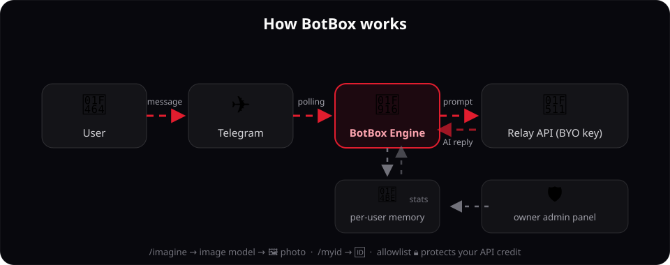

<p align="center">
  
</p>

<p align="center">
  
</p>

<p align="center">
  <a href="LICENSE"></a>
  
  
  
  
</p>

<p align="center">
  <b>Build your own AI Telegram bot in 5 minutes — no code needed.</b><br>
  Paste a BotFather token, pick a persona, bring your own relay API key, deploy. 🤖💕
</p>

> မြန်မာလို: BotFather token�ည့်, persona ရွေး, API key ထည့် — ၅ မိနစ်နဲ့ ကိုယ့် AI Telegram bot ကိုယ်ပိုင်ပြီ။ ကုဒ်ရေးစရာမလို။

<p align="center">
  🌐 <b>Live:</b> <a href="https://botbox.kmnapps.xyz">botbox.kmnapps.xyz</a>
</p>

<p align="center">
  
</p>

## ✨ Features

| | Feature | Details |
|---|---|---|
| 🎭 | **34 personas** | Lover, doctor, programmer, poet, astrologer… bilingual Burmese-first system prompts |
| 🖼️ | **/imagine** | Image generation via relay `/images/generations` — one-tap toggle per bot |
| 🔒 | **Access control** | Per-bot allowlist of Telegram user IDs — strangers can't drain your API credit |
| 🆔 | **/myid** | Anyone can get their Telegram ID to send to the bot owner |
| 🧠 | **Per-user memory** | Last 20 messages per Telegram user as AI context (200 stored) |
| 🛡️ | **Owner admin panel** | Password-protected fleet dashboard: stats, start/stop/delete, message viewer |
| 🎨 | **Cute dark UI** | Glassmorphism, Funapp red glows, animated SVG art, my/en bilingual |
| 🔑 | **BYO API key** | No free tier — you bring your relay key (any OpenAI-compatible relay) |

<p align="center">
  
</p>

## 🚀 Quick start

<details open>
<summary><b>Run locally</b></summary>
<br>

```bash
# backend
cd backend && npm install && npm run smoke && npm start

# frontend (another terminal)
cd frontend && npm install && npm run dev
```

Backend needs one env var: `BOTBOX_MASTER_KEY` (64 hex chars) — used for AES-256-GCM encryption of bot tokens & API keys.

</details>

<details>
<summary><b>Project layout</b></summary>
<br>

```
botbox/
├── backend/          # Node 22 + Express 5 + Telegraf multi-bot engine
│   ├── src/          # routes, engine, personas, relay, db (node:sqlite), admin
│   └── test/smoke.js # 20+ checks, runs on every deploy
├── frontend/         # React 19 + Vite + Tailwind v4, bilingual my/en
├── assets/           # Animated SVGs for this README
└── Feature.md        # Full feature spec & changelog
```

</details>

## 🔐 Security notes

- Bot tokens & relay API keys are **AES-256-GCM encrypted** at rest; never logged, never sent to the browser in full.
- Admin password: salted **scrypt** hash; sessions are 256-bit Bearer tokens (SHA-256 only in DB, 7-day expiry).
- Login/setup rate-limited: 10 attempts / 15 min / IP.
- SSRF guard on all user-supplied relay URLs.
- Allowlisted bots reject strangers **before** any relay call — zero credit spent.

## 📄 License

MIT — see [LICENSE](LICENSE).
